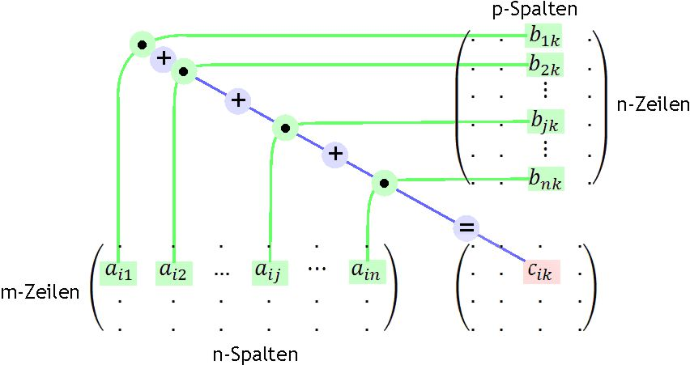

# Matirx multiplication

Matrix multiplication is a fundamental operation in linear algebra where two matrices are combined to produce a new matrix. Unlike element-wise multiplication, matrix multiplication involves a series of dot products between rows and columns. Here's a detailed explanation:

### **Key Points:**
1. **Compatibility:**  
   - For two matrices **A** and **B** to be multiplied (as **A × B**), the number of **columns in A** must equal the number of **rows in B**.  
   - If **A** is of size \( m \times n \), then **B** must be of size \( n \times p \). The resulting matrix **C** will be \( m \times p \).

2. **Calculation:**  
   Each element \( c_{ij} \) of the resulting matrix **C** is computed as the **dot product** of the \( i \)-th row of **A** and the \( j \)-th column of **B**:
   \[
   c_{ij} = \sum_{k=1}^{n} a_{ik} \cdot b_{kj}
   \]
   where \( a_{ik} \) are elements of **A**, and \( b_{kj} \) are elements of **B**.

3. **Step-by-Step Example:**  
   Let’s multiply two matrices:
   \[
   A = \begin{bmatrix}
   1 & 2 \\
   3 & 4 \\
   \end{bmatrix}, \quad
   B = \begin{bmatrix}
   5 & 6 \\
   7 & 8 \\
   \end{bmatrix}
   \]
   - **Step 1:** Check dimensions. Both are \( 2 \times 2 \), so multiplication is valid.  
   - **Step 2:** Compute each element of **C**:
     - \( c_{11} = (1 \times 5) + (2 \times 7) = 5 + 14 = 19 \)
     - \( c_{12} = (1 \times 6) + (2 \times 8) = 6 + 16 = 22 \)
     - \( c_{21} = (3 \times 5) + (4 \times 7) = 15 + 28 = 43 \)
     - \( c_{22} = (3 \times 6) + (4 \times 8) = 18 + 32 = 50 \)
   - **Result:**
     \[
     C = A \times B = \begin{bmatrix}
     19 & 22 \\
     43 & 50 \\
     \end{bmatrix}
     \]

4. **Key Properties:**  
   - **Not Commutative:** \( A \times B \neq B \times A \) (order matters).  
   - **Associative:** \( (A \times B) \times C = A \times (B \times C) \).  
   - **Distributive:** \( A \times (B + C) = A \times B + A \times C \).  
   - **Identity Matrix:** Multiplying by the identity matrix \( I \) leaves the matrix unchanged (\( A \times I = A \)).

5. **Applications:**  
   - Solving systems of linear equations.  
   - Transformations in computer graphics (e.g., rotation/scaling).  
   - Machine learning (e.g., neural networks, dimensionality reduction).  

### **Note:**  
Matrix multiplication is distinct from the Hadamard (element-wise) product, where corresponding elements are multiplied directly.
